# AFK Byte Web

A corporate website for AFK Byte, built with Next.js and TypeScript.

## Table of Contents

- [Key Features](#key-features)
- [Tech Stack](#tech-stack)
- [File Structure](#file-structure)
- [Getting Started](#getting-started)
  - [Prerequisites](#prerequisites)
  - [Installation](#installation)
  - [Running the Development Server](#running-the-development-server)
- [Build](#build)
- [Linting & Formatting](#linting--formatting)

## Key Features

- **Responsive Design**: Adapts to various screen sizes for optimal viewing on desktops, tablets, and mobile devices.
- **Services Showcase**: Clearly presents the services offered by AFK Byte.
- **Blog**: Features articles and updates from AFK Byte.

## Tech Stack

- **Framework**: Next.js (App Router)
- **Language**: TypeScript
- **Styling**: Tailwind CSS
- **UI Components**: Shadcn/UI
- **Linting/Formatting**: ESLint, Prettier (assumed)
- **Package Manager**: npm

## File Structure

An overview of the main directories and their purpose:

```mermaid
graph TD
    A["AFK Byte Web (Root)"] --> B[".next (Build output)"];
    A --> C["app (Routing, Pages, Layouts)"];
    C --> C1["globals.css"];
    C --> C2["layout.tsx (Root Layout)"];
    C --> C3["page.tsx (Homepage)"];
    C --> C4["providers.tsx"];
    C --> C5["about/page.tsx"];
    C --> C6["blog/page.tsx"];
    C --> C7["careers/page.tsx"];
    C --> C8["contact/page.tsx"];
    C --> C9["projects/page.tsx"];
    C --> C10["services/page.tsx"];
    A --> D["components (Reusable UI Components)"];
    D --> D1["about/"];
    D --> D2["blog/"];
    D --> D3["careers/"];
    D --> D4["contact/"];
    D --> D5["home/"];
    D --> D6["layout/ (Header, Footer)"];
    D --> D7["projects/"];
    D --> D8["services/"];
    D --> D9["ui/ (Shadcn/UI components)"];
    A --> E["hooks (Custom React Hooks)"];
    E --> E1["use-toast.ts"];
    A --> F["lib (Utilities, Constants)"];
    F --> F1["constants.ts"];
    F --> F2["utils.ts"];
    A --> G["public (Static Assets - *assumed*)"];
    A --> H["package.json (Dependencies & Scripts)"];
    A --> I["next.config.js (Next.js Config)"];
    A --> J["tailwind.config.ts (Tailwind CSS Config)"];
    A --> K["tsconfig.json (TypeScript Config)"];
```



## Getting Started

### Prerequisites

- Node.js (e.g., v18.x or later)
- npm

### Installation

1.  Clone the repository:
    ```bash
    git clone <repository-url>
    ```
2.  Navigate to the project directory:
    ```bash
    cd afk-byte-web
    ```
3.  Install dependencies:
    ```bash
    npm install
    ```

### Running the Development Server

1.  Start the development server:
    ```bash
    npm run dev
    ```
2.  Open [http://localhost:3000](http://localhost:3000) in your browser.

## Build

To build the application for production:

```bash
npm run build
```

## Linting & Formatting

To run linters (ensure the script is configured in your `package.json`):

```bash
npm run lint